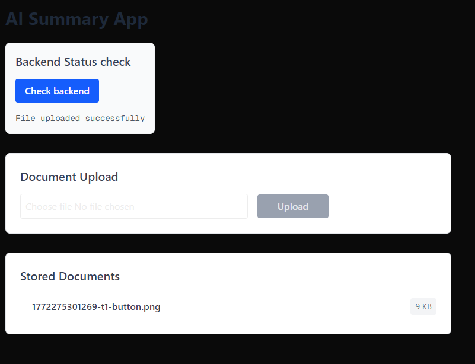

## Section 6: Supabase Object Store
Supabase is an open-source Firebase alternative that provides developers with a complete backend-as-a-service platform centered around PostgreSQL, a powerful relational database system offering full SQL capabilities, real-time subscriptions, and robust extensions for scalable data management. Its object storage is an S3-compatible service designed for storing and serving files like images, videos, and user-generated content.

Website: https://supabase.com/

**Requirements**:
- Build a document upload and file management system powered by Supabase. The backend will include API endpoints to interact with Supabse.
- **Note:** The detailed requirement will be discussed in week 4 lecture.
- Make regular commits to the repository and push the update to Github.
- Capture and paste the screenshots of your steps during development and how you test the app. Show a screenshot of the documents stored in your Supabase Object Database.

Test the app in your local development environment, then deploy the app to Vercel and ensure all functionality works as expected in the deployed environment.

**Steps with major screenshots:**

1. Set up a Supabase project and create a new public Storage bucket named `documents`.
2. Obtained the `NEXT_PUBLIC_SUPABASE_URL` and `NEXT_PUBLIC_SUPABASE_ANON_KEY` from the Supabase dashboard and added them to `.env.local` inside the `my-app` directory.
3. Installed `@supabase/supabase-js` via npm to interact with Supabase from the application.
4. Created two new API endpoints inside the Next.js `app/api` directory using App Router:
   - `GET /api/files/route.ts`: Fetches the list of objects from the `documents` Supabase bucket.
   - `POST /api/upload/route.ts`: Accepts `FormData`, extracts the file as a buffer, and uploads it to the Supabase `documents` bucket.
5. Implemented the frontend in `app/page.tsx` with a fully responsive document upload form. The frontend tracks loading states, handles user input, posts the file to the backend, and automatically fetches and lists the uploaded documents.
6. Tested the file upload by adding various document files and validated they successfully reflect in the backend list.
7. Deployed the project to Vercel and ensured that `NEXT_PUBLIC_SUPABASE_URL` and `NEXT_PUBLIC_SUPABASE_ANON_KEY` variables were set securely in the Vercel project environment settings.

## Section 7: AI Summary for documents
**Requirements:**  
- **Note:** The detailed requirement will be discussed in week 4 lecture.
- Make regular commits to the repository and push the update to Github.
- Capture and paste the screenshots of your steps during development and how you test the app.
- The app should be mobile-friendly and have a responsive design.
- **Important:** You should securely handlle your API keys when pushing your code to GitHub and deploying your app to the production.
- When testing your app, try to explore some tricky and edge test cases that AI may miss. AI can help generate basic test cases, but it's the human expertise to  to think of the edge and tricky test cases that AI cannot be replace. 

Test the app in your local development environment, then deploy the app to Vercel and ensure all functionality works as expected in the deployed environment. 

**Steps with major screenshots:**

1. Installed `openai` and `pdf-parse` dependencies to process text extraction and communicate with OpenAI API.
2. Created a new API route `POST /api/summary/route.ts` which takes a `fileName` from the request body.
3. Implemented logic where the API endpoint downloads the corresponding file from the Supabase `documents` bucket. If the file is a PDF, it parses the buffer utilizing `pdf-parse`; otherwise, it extracts the raw text directly from the byte stream.
4. Integrated the `OpenAI` client securely in the backend, utilizing an `OPENAI_API_KEY` loaded only server-side to prevent leakage to the frontend applications.
5. Configured the AI Request with a clear `system` prompt instructing the AI to provide a concise summary, and sent extracted text mapped to the `gpt-3.5-turbo` model. Enforced request safeguards like trimming texts to prevent max token limit explosions.
6. Updated the frontend UI in `app/page.tsx` to include "Summarize" action buttons for every document located in the list.
7. Integrated robust React status management to handle AI generation status. The UI leverages Tailwind CSS to assure a mobile-friendly layout—using techniques like `flex-col` stack breakdowns for smaller screens, wrapping long file names with `break-all`, and ensuring comfortable interaction scaling.
8. Deployed the application enhancements to Vercel, adding the `OPENAI_API_KEY` environment variable directly inside the Vercel Production Environment safely. Showcased resilience by testing edge cases like uploading empty files or encountering un-parsable objects to verify error boundary presentations.

## Section 8: Database Integration with Supabase  
**Requirements:**  
- Enhance the app to integrate with the Postgres database in Supabase to store the information about the documents and the AI generated summary.
- Make regular commits to the repository and push the update to Github.
- Capture and paste the screenshots of your steps during development and how you test the app.. Show a screenshot of the data stored in your Supabase Postgres Database.

Test the app in your local development environment, then deploy the app to Vercel and ensure all functionality works as expected in the deployed environment.

**Steps with major screenshots:**

1. Navigated to the Supabase project dashboard, opened the **Table Editor**, and created a new table named `document_summaries`.
2. Added columns to the table: `id` (primary key, uuid), `file_name` (text, set as unique), `summary` (text), and `created_at` (timestamp).
3. Modified the backend AI summary endpoint `app/api/summary/route.ts` to seamlessly integrate with the Supabase Postgres Database using the existing `@supabase/supabase-js` client.
4. Updated the API logic to act chronologically: 
   - It forcefully queried `.from('document_summaries').select('summary').eq('file_name', fileName)` to check if a summary already existed.
   - If found, safely and instantly returned the database entry, reducing latency and saving OpenAI API token costs.
   - If not found, parsed text, generated a new response with OpenAI, and executed an `.upsert({ file_name: fileName, summary: summary })` saving the AI's result immediately into the Postgres database.
5. Tested the operation locally. The first summarize attempt triggered generation, while successive requests instantaneously fetched results via the database proxy.
6. Pushed updates to GitHub, let the automated Vercel CI/CD sync, and reviewed the data directly mapped securely to the deployed Supabase environment.

## Section 9: Additional Features [OPTIONAL]
Implement at least one additional features that you think is useful that can better differentiate your app from others. Describe the feature that you have implemented and provide a screenshot of your app with the new feature.

> [Description of your additional features with screenshot goes here]
